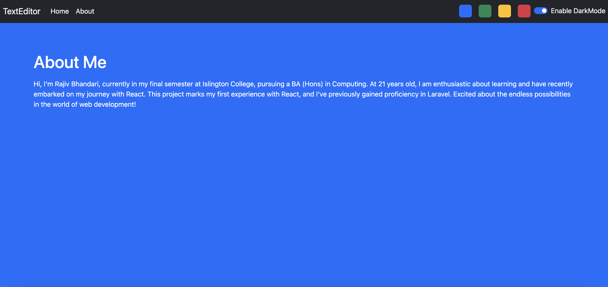
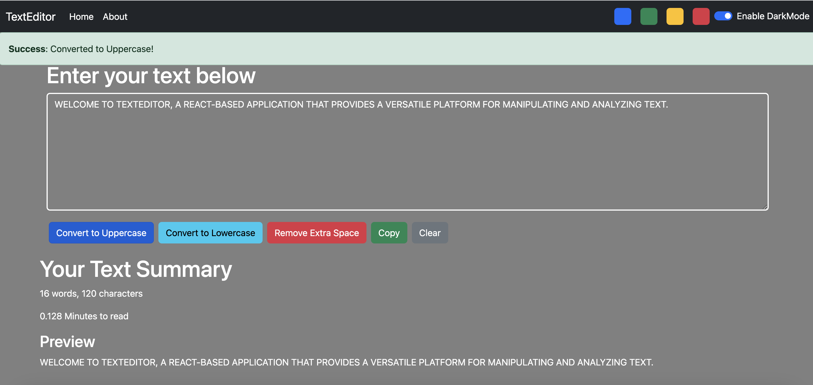

# TextEditor - React Application

Welcome to TextEditor, a React-based application that provides a versatile platform for manipulating and analyzing text. With a user-friendly interface, TextEditor offers features such as word count, character count, and estimated reading time for entered text. The real-time preview allows you to see how your text will appear, making editing and formatting seamless. Additionally, you can easily convert text to uppercase or lowercase, remove extra spaces, copy content, and clear the text field. The application supports a dark mode for enhanced readability, and you can personalize the experience further by choosing from four distinct color themes: blue, green, yellow, and red. For more information, check out the "About" section to learn about the creator and gain insights into the motivation behind this project. Explore the functionalities and make your text editing experience more efficient with TextEditor!

## Home page - Light mode

## Dark mode

## About Me - Blue color active

## Alert

